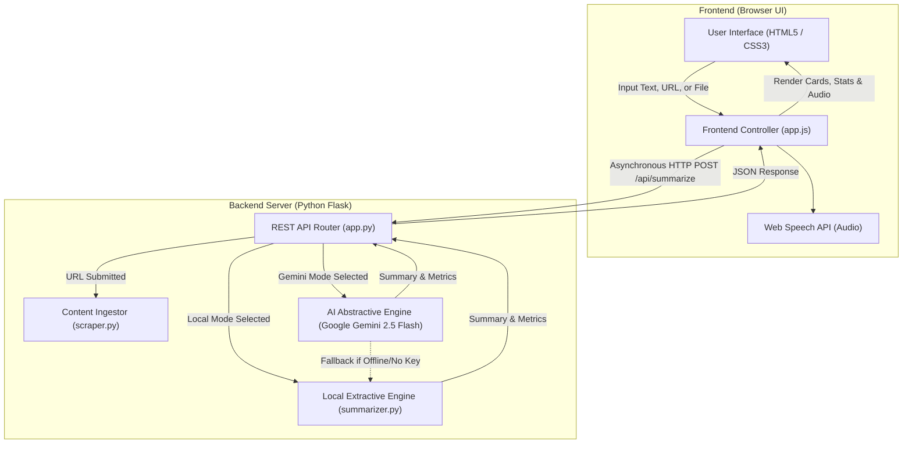

# How the AI Text Summarizer Works: A Plain-English Guide

> **Who this guide is for:** Anyone curious about how this application works under the hood — whether you have no coding background or you are an aspiring developer looking to understand modern Natural Language Processing (NLP), Web Scraping, and Generative AI.

---

## 1. The Big Picture: What Does This App Do?

Imagine you are given a 20-page research report, a long news article, or a heavy PDF, and you only have 60 seconds before your next meeting.

The **AI Text Summarizer** acts as your personal reading assistant. You feed it long-form text (either by pasting words, pasting a website link, or uploading a file), and within seconds it gives you a clean, compressed version in your choice of format:
- A short **paragraph**
- Bulleted **key takeaways**
- A 1–2 sentence **TL;DR** ("Too Long; Didn't Read")

To accomplish this, the application combines two distinct technologies:
1. **A Local NLP Engine ("The Highlighter"):** Runs instantly on your computer without internet, finding and stitching together the most important existing sentences.
2. **An AI Engine ("The Ghostwriter"):** Powered by Google Gemini, which reads the entire article, understands its meaning, and rewrites the core message in fresh, human-like language.

---

## 2. Essential Technical Terms (Demystified)

Here is a quick dictionary of the core technical terms used across this project, explained with real-world analogies:

| Technical Term | What It Means in Plain English | Real-World Analogy |
| :--- | :--- | :--- |
| **NLP (Natural Language Processing)** | A branch of computer science that teaches computers how to read, understand, and manipulate human language. | Teaching a computer English grammar and meaning instead of just numbers. |
| **Extractive Summarization** | Creating a summary by selecting and pulling out the most important verbatim sentences directly from the original text. | Reading an article with a yellow highlighter and copying only the highlighted sentences into a notebook. |
| **Abstractive Summarization** | Creating a summary by understanding the concepts and writing new sentences from scratch. | An executive assistant who reads a 10-page memo and tells you in their own words what it means. |
| **LLM (Large Language Model)** | An advanced AI model trained on vast amounts of text that can generate human-like sentences (e.g., Google Gemini). | A super-smart collaborator that has read millions of books and can write essays, answer questions, or summarize content. |
| **Tokenization** | Splitting a long block of text into smaller individual pieces, such as sentences or individual words. | Taking a paragraph and cutting it with scissors into individual sentence strips and word flashcards. |
| **Stop Words** | Common words (like *"the"*, *"is"*, *"at"*, *"which"*, *"on"*) that provide grammatical structure but carry little unique meaning. | The filler or glue words in a sentence that you naturally skip when scanning a newspaper headline. |
| **Word Salience & Frequency** | Measuring how important a word is by counting how frequently it appears in a text compared to general filler words. | If an article mentions *"quantum"* 25 times, *"quantum"* is central to the topic. |
| **Lead Bias** | In journalism and professional writing, the most important information is usually placed in the first few sentences (the "lead"). | Reading the first paragraph of a news story to get the gist of what happened before diving into background details. |
| **Web Scraping & DOM Parsing** | Downloading a web page's raw code (HTML) and extracting just the readable article text while stripping away ads, sidebars, and navigation menus. | Filtering out the commercials and pop-up banners so you only read the actual magazine article. |
| **REST API (Application Programming Interface)** | A standardized messenger that allows the user interface (the buttons and sliders in your browser) to talk to the Python brain on the server. | A waiter in a restaurant: you (the user) place an order (request), the waiter takes it to the kitchen (server), and brings back your meal (summary). |
| **Single Page Application (SPA)** | A modern web design where the page never needs to do a full refresh when you click buttons; updates happen smoothly and instantly. | A desktop app or mobile app that updates its screens without reloading a white screen in between. |
| **Temperature (AI Parameter)** | A setting that controls how "creative" or "focused" the AI model should be when writing. Low temperature = factual and predictable; High temperature = imaginative. | Dialing between a strict court reporter (low temperature) and a creative poet (high temperature). |

---

## 3. The Architecture: How the Pieces Fit Together

The system is organized into three main layers:

### Layer 1: The Frontend (The Cockpit in Your Browser)
- **Built with:** Plain HTML5, Vanilla CSS, and Modern JavaScript.
- **Why Vanilla?** Rather than using heavy frameworks like React or Angular that require complex build steps and download megabytes of code, this application uses pure browser-native technologies. It loads in milliseconds, uses minimal memory, and runs on any device.
- **Key Features:**
  - **Dynamic Input Tabs:** Easily switch between direct text paste, a website URL link, or document file uploads.
  - **Live Counters:** Counts words, characters, and estimated reading time as you type.
  - **Interactive Controls:** Sliders to choose summary density (Concise, Balanced, Detailed) and format toggle buttons.
  - **Productivity Utilities:** One-click copy, download as Markdown (`.md`) or text (`.txt`), and text-to-speech audio narration using your browser's built-in `speechSynthesis` engine.

### Layer 2: The Ingestion Engine ([`scraper.py`](file:///c:/Users/Emma/Desktop/GITHUB/Text_summariser/Text_Summariser/scraper.py))
Before text can be summarized, it must be ingested and cleaned:
1. **From a URL:** When you provide a website link, Python's `requests` library downloads the raw HTML web page. Then, `BeautifulSoup` (an HTML parser) strips away `<script>`, `<style>`, `<nav>`, and advertisement containers, locating the true `<article>` or `<main>` body text.
2. **From a PDF:** The `pypdf` library extracts text from every page sequentially, ignoring embedded imagery and binary headers.
3. **From a Text File:** Plain text or markdown files are decoded using safe UTF-8/Latin-1 encodings.

### Layer 3: The Summarization Brains ([`summarizer.py`](file:///c:/Users/Emma/Desktop/GITHUB/Text_summariser/Text_Summariser/summarizer.py))
The app provides two distinct engines:

#### Engine A: Local Extractive Engine (Zero Internet Required)
How does a computer decide which sentences in an article are the "most important" without using an AI chatbot?
1. **Sentence Segmentation:** The text is split into individual sentences using the **NLTK (Natural Language Toolkit)** sentence tokenizer.
2. **Word Scoring (Frequency & Salience):** Every word is counted, excluding common stop words (like *"and"*, *"the"*, *"with"*). Rare and informative words receive higher weight.
3. **Sentence Scoring:** Each sentence receives a score based on:
   - **Word Weights:** Does the sentence contain the article's most prominent keywords?
   - **Position Bias:** Sentences appearing near the beginning of paragraphs and the start of the document receive an automatic score boost (emulating how human editors organize key facts).
   - **Length Normalization:** Prevents the algorithm from unfairly favoring long, run-on sentences over concise, punchy statements.
4. **Sentence Selection & Flow:** The top-ranked sentences are selected according to your requested density percentage (e.g., 35%), and then re-arranged back into their original chronological order so the summary reads naturally.

#### Engine B: Google Gemini Abstractive Engine (Next-Gen AI)
When connected to Google Gemini (`gemini-2.5-flash`) via the official `google-genai` SDK:
1. **Contextual Prompting:** The server crafts a prompt instructing Gemini to act as an executive editor, specifying the exact requested format (Paragraph, Bullet points, or TL;DR) and length constraint.
2. **Temperature Control:** Set to `0.3` (low temperature), ensuring the AI stays strictly faithful to the source facts without hallucinating external information.
3. **Graceful Fallback:** If you do not have an API key, or if your internet drops, the server automatically and silently falls back to the Local Extractive Engine. The user never sees a crash or broken screen.

### Layer 4: Analytics & Key Concept Mining
Once a summary is generated, the server calculates:
- **Compression Percentage:** `((Original Words - Summary Words) / Original Words) * 100`
- **Time Saved:** Calculates minutes and seconds saved based on an average human reading speed of 220 words per minute.
- **Thematic Keyword Tags:** Mines the top 8 most statistically distinctive nouns and topic concepts to display as clickable topic badges.

---

## 4. Step-by-Step: The Journey of a Request

Here is what happens from the moment you click **"Summarize Text"**:

1. **User Action:** You paste an article into the browser and click the gradient **"Summarize Text"** button.
2. **Client Validation:** `app.js` verifies the text contains at least 10 words. It shows a smooth glowing skeleton loader to signal that work is underway.
3. **HTTP Dispatch:** The browser packages your text, engine choice, summary format, and density percentage into a JSON payload and sends it to `POST /api/summarize`.
4. **Server Routing:** Flask receives the request in [`app.py`](file:///c:/Users/Emma/Desktop/GITHUB/Text_summariser/Text_Summariser/app.py) and delegates it to [`summarizer.py`](file:///c:/Users/Emma/Desktop/GITHUB/Text_summariser/Text_Summariser/summarizer.py).
5. **Computation:** The chosen engine (Local or Gemini) compresses the text and extracts key topics.
6. **JSON Reply:** The server returns the final summary, keyword tags, and reading metrics back to the browser.
7. **Display:** The frontend removes the loader, animates the result card, updates the metric badges (e.g. *72% Reduced*), and prepares the text-to-speech voice player.

---

## 5. Summary of Design Decisions

| Decision | Why It Was Made |
| :--- | :--- |
| **Dual-Engine Architecture** | Gives you the best of both worlds: complete offline privacy & instant speed with Local NLP, plus state-of-the-art rewriting power with Google Gemini. |
| **Zero-Build Vanilla Frontend** | Eliminates npm dependencies, node_modules bloat, and build step compilation errors. You can run the entire app with a single Python command. |
| **Automatic Offline Fallback** | Ensures the application never fails or displays an error screen if Gemini API quotas are exhausted or internet connectivity is lost. |
| **Multi-Source Ingestion** | Enables busy users to summarize anything from raw text and academic PDF documents to live online news articles without manually copying and pasting. |
